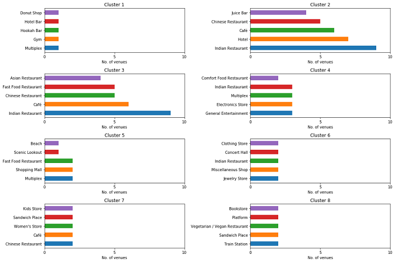
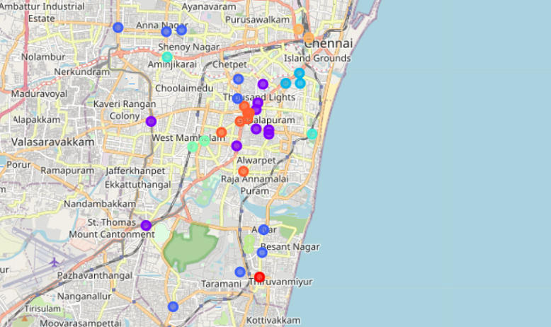
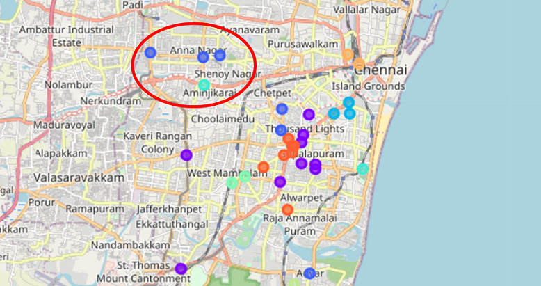

# Battle-of-Neighborhoods-Chennai-Venues
Capstone Project: Battle of Neighborhoods of Chennai Venues

## Table of contents:
1. [Introduction: Business Problem](#intro)
2. [Data Requirements](#data)
3. [Results and Discussion](#results)

## Introduction: Business Problem 

This project deals with discussing the neighborhoods of **Chennai, The Detroit of India**. This would specifically help Business people planning to start **Restaurants, Hotels, etc.** in Chennai, Tamil Nadu, India.

The **Foursquare API** is used to access the venues in the neighborhoods. Since, it returns less venues in the neighborhoods, we would be analysing areas for which countable number of venues are obtained. Then they are clustered based on their venues using Data Science Techniques. Here the **k-means clustering algorithm** is used to achieve the task. The optimal number of clusters can be obtained using **silhouette score** metrics. **Folium visualization library** can be used to visualize the clusters superimposed on the map of Chennai city. These clusters can be analyzed to help small scale business owners select a suitable location for their need such as Hotels, Shopping Malls, Restaurants or even specifically Indian restaurants or Coffee shops.

The major **Target Audience** would be small-scale business owners and stake holders planning to start their business at a location in Chennai. This project would help them find the optimal location based on the category of their business such as,

*	What is the best location to start a new hotel in Chennai with restaurants around?
*	Which area is best suitable for opening a Shopping Mall in Chennai?

## Data Requirements 

Chennai has multiple neighborhoods. The chennaiiq.com website has a dataset which has the list of locations in Chennai along with their Latitude and Longitude. In order to obtain the venue details in each neighborhood Foursquare API is used.

1.	https://chennaiiq.com/chennai/latitude_longitude_areas.asp
2.	https://foursquare.com/

There is a total of 105 neighborhoods. But the Latitude and Longitude data obtained are in Degrees Minute Seconds format which needs to be converted to Decimal Degrees Format. The following data are obtained from the Foursquare API, 

*	Venue
*	Venue Latitude
*	Venue Longitude
*	Venue Category data

A total of 1130 venues data have been obtained from Foursquare.

## Results and Discussion 

Using the clusters and the top venue categories let’s visualize the top 5 venue category in each Cluster for comparison. 

  

This plot can be used to suggest valuable information to Business persons. Let's discuss a few examples considering they would like to start the following category of business.

#### 1. Hotel

The neighborhoods in cluster 2 has the greatest number of hotels, hence opening one here is not the best choice. So, is it best to open one at the neighborhoods in cluster 7 or 8? Not likely, since the place has a smaller number of food restaurants. Thus, an optimal place would be one which has less hotels, but also have restaurants and other places to explore. Considering all these facts, the best choice would be Cluster 3 and Cluster 4. such as the Adyar Bus Depot, Triplicane neighborhoods.

#### 2. Shopping Mall

The neighborhoods 5 has notable number of shopping malls. By using the same procedure as above, the suitable cluster would be the Cluster 2 and Cluster 3, since it has not much shopping malls and also it has many Hotels and Restaurants which gives an advantage.

Similarly, based on the requirement suggestions can be provided about the neighborhood that would be best suitable for the business. The following is a map of Chennai with the neighborhood clusters superimposed on top of it. This map can be used to suggest a vast location to start a new business based on the category.

  

For example, the highlighted location shown in the below figure consists of Cluster 3 and Cluster 5, whose neighborhoods have many Restaurants and Shopping Malls but less Hotels. Thus, this would be a suitable location for building a hotel.

  

